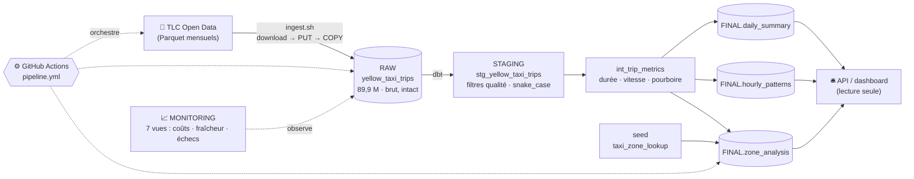

# 🚕 NYC Taxi Data Pipeline — Irregular Croppers

[](https://github.com/Simplon-DE-P1-2025/nyc-taxi-irregular-croppers/actions/workflows/pipeline.yml)
[](https://github.com/Simplon-DE-P1-2025/nyc-taxi-irregular-croppers/actions/workflows/ci.yml)
[](https://simplon-de-p1-2025.github.io/nyc-taxi-irregular-croppers/)

Pipeline de données **de bout en bout** sur les [NYC Yellow Taxi Trip Records](https://www.nyc.gov/site/tlc/about/tlc-trip-record-data.page) :
ingestion → nettoyage → transformation (**dbt**) → analyse, dans **Snowflake**, orchestré par **GitHub Actions**.

| Le pipeline en chiffres | |
|---|---|
| Lignes ingérées (RAW) | **89,9 M** (24 mois : 2024-2025) |
| Trajets après nettoyage | **83,8 M** (−6,7 % d'anomalies) |
| Tests qualité dbt | **41** à chaque build |
| Durée d'un run complet | **≈ 3 min 20** |
| Coût d'un run | **≈ 0,06 crédit (~18 ¢)** |
| Compute total du projet | **≈ 6 $** (warehouse X-Small) |

## 🗺️ Architecture



Principes : **ELT** (on charge brut, on transforme dans l'entrepôt), **idempotence** à chaque
étape (un run peut être rejoué sans risque), **RAW jamais retouchée** (traçabilité
`loaded_at` / `source_file` sur chaque ligne).

## ⚙️ Les 4 workflows

| Workflow | Déclencheur | Rôle |
|---|---|---|
| `pipeline.yml` | manuel (`workflow_dispatch`) | le run complet : connexion → infra (idempotente) → ingestion → `dbt build` (seed + 5 modèles + 41 tests) |
| `ci.yml` | chaque Pull Request | `ruff` + `dbt parse` — sans toucher Snowflake |
| `docs.yml` | push sur `main` (chemins dbt) | publie la [doc dbt](https://simplon-de-p1-2025.github.io/nyc-taxi-irregular-croppers/) sur GitHub Pages |
| `release.yml` | tag `v*` | crée la release GitHub |

## 🚀 Démarrer

- **Nouveau sur le projet ? → [docs/onboarding.md](docs/onboarding.md)** — du clone au `dbt build` (connexion Snowflake par clé RSA, infra, seed de dev).
- Le sujet : [docs/brief.md](docs/brief.md) · L'organisation : [docs/workflow-equipe.md](docs/workflow-equipe.md) · [docs/guide-github-projects.md](docs/guide-github-projects.md)

```text
.
├── .github/workflows/   pipeline · ci · docs · release
├── scripts/             download_data.py · ingest.sh (download → PUT → COPY)
├── snowflake/           01_setup_infra.sql · 02_monitoring.sql (7 vues)
├── dbt_nyc_taxi/        le projet dbt : staging → intermediate → marts (+ tests, seed)
└── docs/                onboarding, architecture, guides, rapport d'analyse…
```

## 📦 Livrables

- 📊 **[Rapport d'analyse](docs/rapport-analyse.md)** — saisonnalité, heures de pointe, zones, catégories de courses
- 📚 **[Documentation dbt](https://simplon-de-p1-2025.github.io/nyc-taxi-irregular-croppers/)** — modèles, colonnes, lineage (auto-publiée)
- 🚖 **[La démo frontend](docs/demo-frontend.md)** — le pipeline raconté et piloté depuis un site (run lancé en direct pendant la soutenance)
- 🏗️ [Architecture cible](docs/architecture-cible.md) · [Transformations dbt](docs/transformations-dbt.md) · [Monitoring Snowflake](docs/monitoring-snowflake.md)

## 👥 L'équipe

| | Lane principale |
|---|---|
| **Romain** | CI/CD · releases · monitoring |
| **Sabine** | dbt — staging & métriques |
| **Mohamed** | tests qualité dbt |
| **Alexandre** | ingestion · marts |

Méthode : une **issue** par tâche, une branche, une **PR relue** (main protégée, 1 approbation),
CI verte avant merge, board GitHub Projects. 35 PR mergées, 40 reviews, 114 commits.

> ⚠️ Règles d'or : jamais de secret/clé/donnée dans Git · `main` protégée · chaque membre
> travaille sur **son** compte Snowflake (les secrets du repo pointent celui de la démo).
