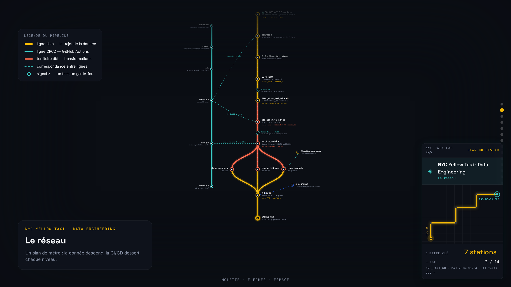
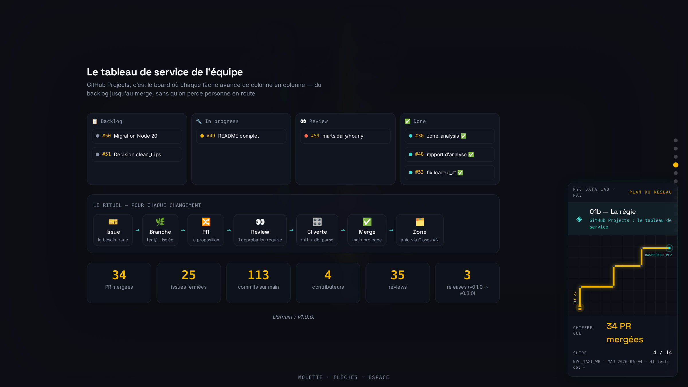
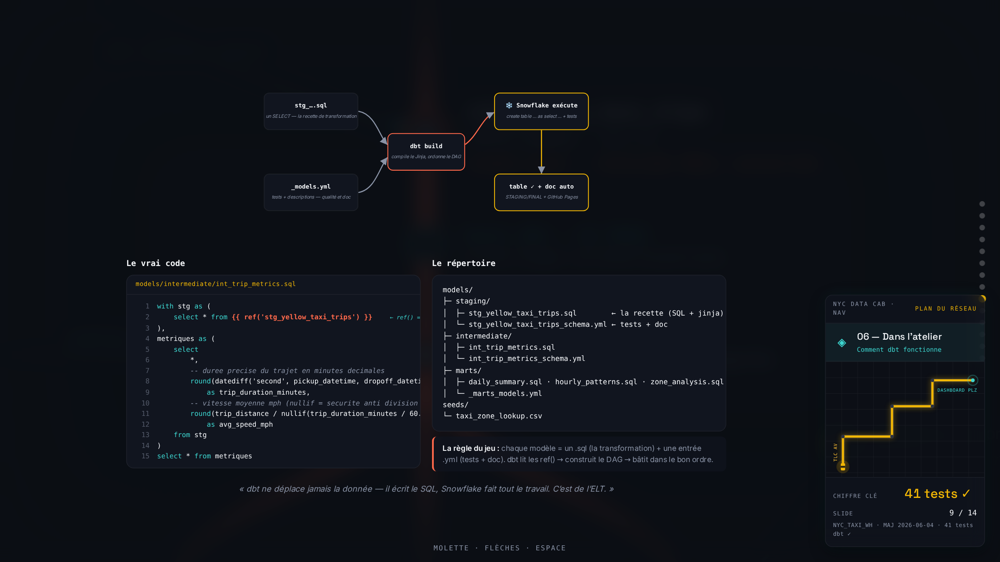
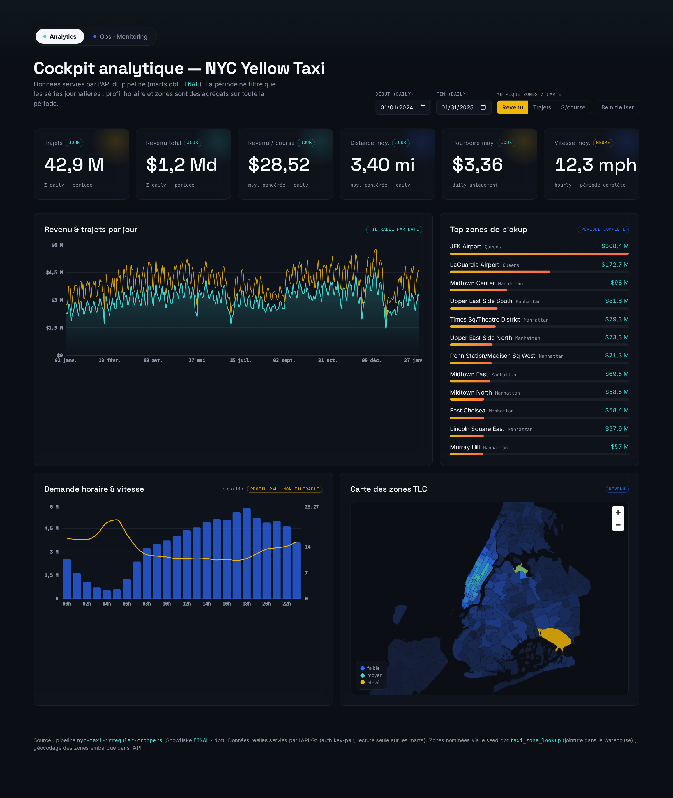
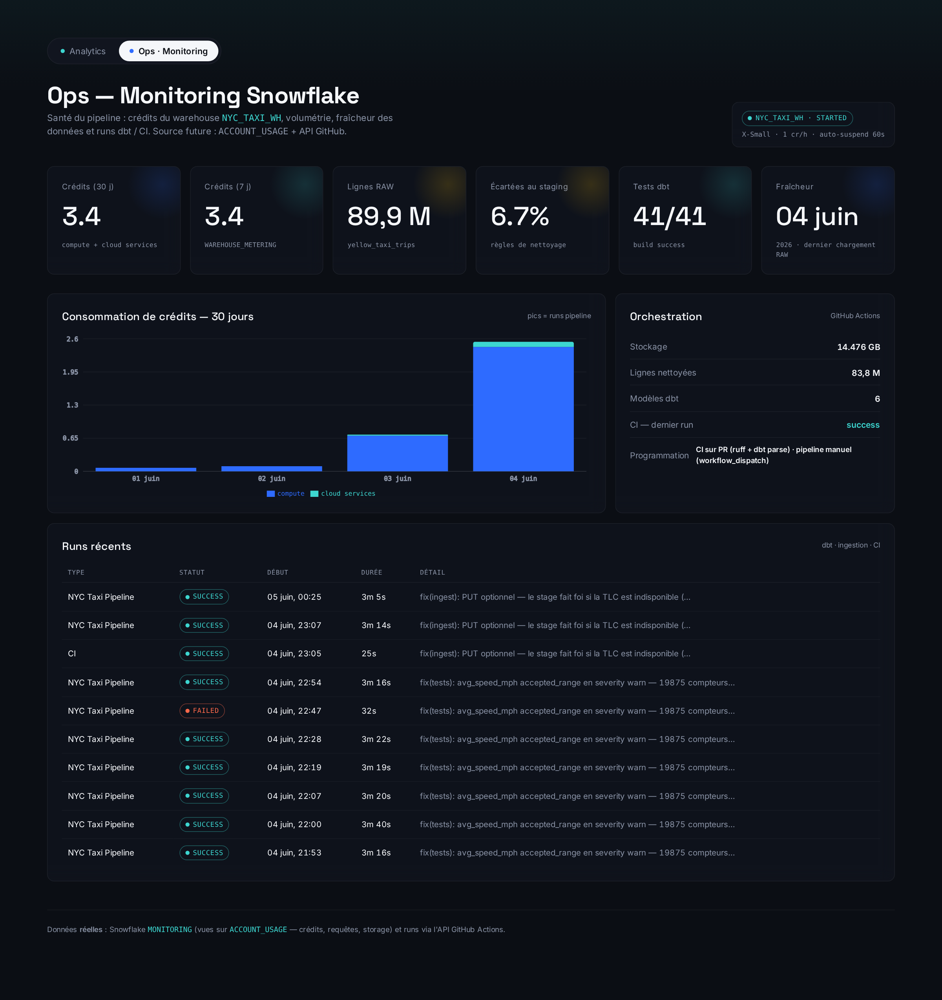

# 🚖 La démo frontend — le pipeline raconté et piloté depuis un site

> Document à destination du correcteur : ce que montre la démonstration présentée en
> soutenance, comment elle fonctionne, et ce qu'elle prouve sur le pipeline de ce dépôt.

## Ce que c'est

Un site « scrollytelling » qui présente le pipeline comme **un plan de métro new-yorkais** :
la donnée descend la ligne (TLC → ingestion → RAW → dbt → marts FINAL), la ligne CI/CD
(GitHub Actions) dessert chaque niveau. La présentation se déroule en quatre temps :

1. **Le deck** — 14 slides = 14 zooms dans le même grand plan (légende, opérateurs de la
   stack, GitHub Projects, chaque couche de données, les tests, la salle de contrôle) ;
2. **Le film** — un trajet immersif de nuit dans NYC, 5 phrases qui résument le système ;
3. **Le run en direct** — un bouton « Démarrer le run » qui déclenche le **vrai**
   `pipeline.yml` de ce dépôt et le suit en temps réel (voir ci-dessous) ;
4. **Le dashboard** — les 3 marts FINAL interrogés en live (KPIs, périodes, carte des zones)
   et la page de monitoring (crédits, fraîcheur, runs).

| | |
|---|---|
|  |  |
|  |  |
|  |  |

## Comment ça fonctionne

```
Navigateur (Next.js 15, statique)          API Go (lecture seule)            Ce dépôt
┌──────────────────────────┐   fetch    ┌───────────────────────┐
│ deck / film / dashboard  │ ─────────► │ 12 endpoints JSON      │ ──► Snowflake FINAL.* / MONITORING.*
│ widget GPS + taximètre   │  poll 500ms│ cache TTL, key-pair RSA│ ──► INFORMATION_SCHEMA (QUERY/COPY_HISTORY)
└──────────────────────────┘            │ POST /api/ops/run      │ ──► GitHub Actions API (workflow_dispatch
                                        └───────────────────────┘      + suivi des steps du run)
```

- **Frontend** : Next.js 15 (App Router), aucun framework de slides — le plan est un SVG
  maison, la caméra est un `transform` piloté au scroll. Tous les chiffres affichés
  viennent de l'API (un seul réglage : `NEXT_PUBLIC_API_BASE`) ; sans API, le site
  fonctionne sur des données mock au même contrat.
- **API Go** : bibliothèque standard + driver Snowflake uniquement. Authentification par
  **paire de clés RSA** (aucun mot de passe), **lecture seule** sur les données. Elle sert
  les marts au dashboard et joue la « télécommande » du pipeline.
- **Le bouton « Démarrer le run »** envoie un `workflow_dispatch` sur `pipeline.yml` de ce
  dépôt, puis reconstruit l'état du run en croisant : les **steps GitHub Actions**, les
  requêtes en cours dans `QUERY_HISTORY_BY_WAREHOUSE` (le modèle dbt en construction), les
  lignes chargées dans `COPY_HISTORY`, et `SHOW WAREHOUSES` pour le taximètre (crédits).
  À l'arrivée : un « reçu de course » — durée, lignes, 41 tests, coût réels.

## Ce que la démo prouve (le test de bout en bout)

La veille de la soutenance, test grandeur nature :

1. `TRUNCATE TABLE RAW.YELLOW_TAXI_TRIPS` — la table brute est **vidée** (89,9 M de lignes),
   ce qui réinitialise aussi le load history du COPY ;
2. **un clic** sur « Démarrer le run » depuis le site ;
3. trois minutes vingt-deux plus tard : **89 892 322 lignes rechargées**, les 5 modèles dbt
   reconstruits, **41 tests de qualité au vert** (1 warning assumé et documenté), marts
   à jour — pour **≈ 0,06 crédit Snowflake (~18 cents)**.

Pendant ce temps, le dashboard a continué de servir les données : les couches sont
découplées (FINAL reste en place tant que dbt n'a pas rebâti). L'ingestion est
**idempotente** (un fichier déjà chargé est sauté) et **résiliente** : si la TLC est
indisponible (403 vécu la veille), le stage Snowflake fait foi et le run passe quand même.

## Liens

- 📚 Doc dbt auto-publiée : <https://simplon-de-p1-2025.github.io/nyc-taxi-irregular-croppers/>
- 📊 [Rapport d'analyse](rapport-analyse.md) — les enseignements métier des 89,9 M de courses
- 🏗️ [Architecture cible](architecture-cible.md) · [Transformations dbt](transformations-dbt.md) · [Monitoring](monitoring-snowflake.md)

*Le site de démonstration est développé dans un dépôt personnel d'un membre de l'équipe ;
il consomme ce pipeline sans rien y modifier (lecture seule).*
