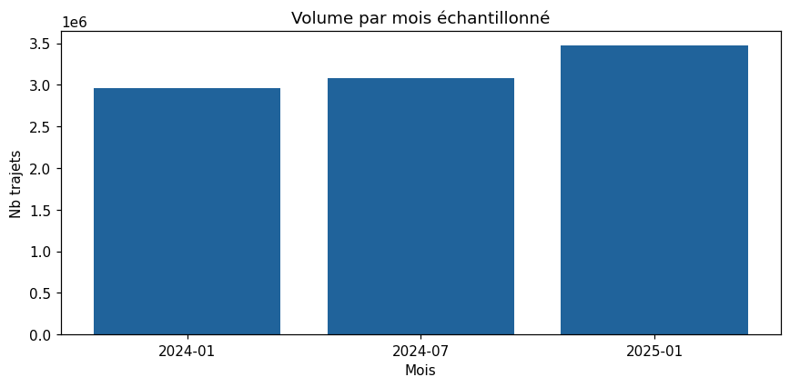
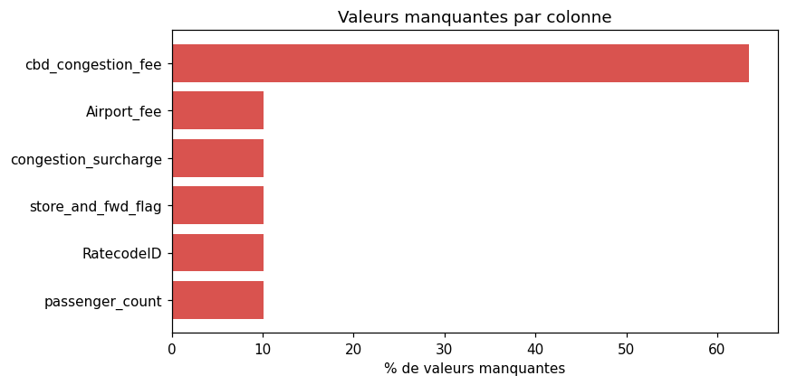
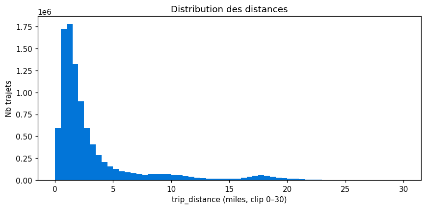
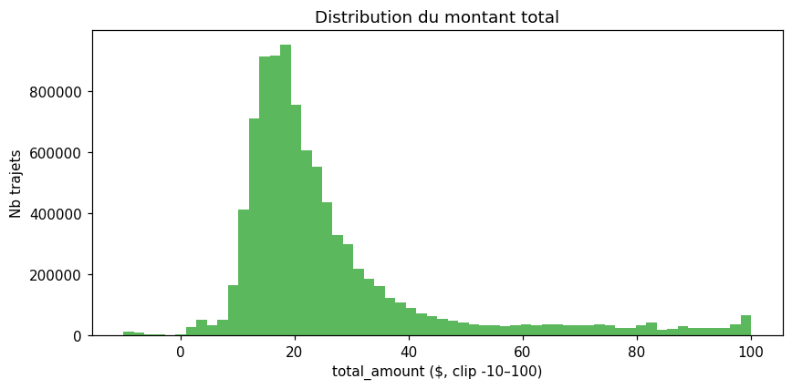
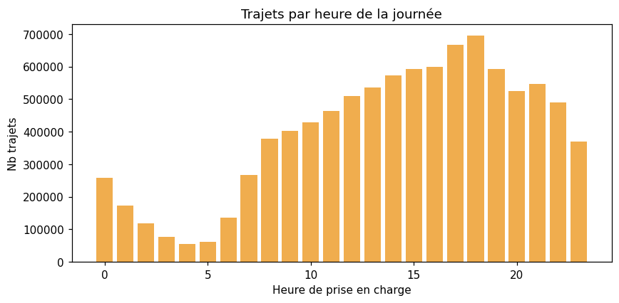
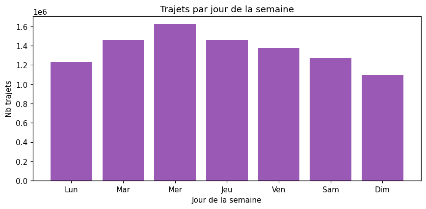

# Rapport d'exploration des données — NYC Yellow Taxi

> EDA réalisée sur **3 mois représentatifs** (2024-01, 2024-07, 2025-01) — hiver / été / début 2025. Total analysé : **9 516 753 trajets**.
> Généré par `scripts/explore_data.py` (Polars). Figures dans `reports/figures/`.

## 1. Vue d'ensemble
| Mois | Trajets |
|---|---:|
| 2024-01 | 2 964 624 |
| 2024-07 | 3 076 903 |
| 2025-01 | 3 475 226 |
| **Total échantillon** | **9 516 753** |

- **Colonnes** : 19 en 2024, **20 dès 2025** (union = 20 ; cf. drift §3 bis). Dataset complet 2024+début 2025 ≈ **40 M trajets**.
- **Doublons exacts** : 1 (0.00 %)



## 2. Schéma réel & valeurs manquantes
| Colonne | Type | Manquants | % |
|---|---|---:|---:|
| `VendorID` | Int32 | 0 | 0.00 % |
| `tpep_pickup_datetime` | Datetime(time_unit='us', time_zone=None) | 0 | 0.00 % |
| `tpep_dropoff_datetime` | Datetime(time_unit='us', time_zone=None) | 0 | 0.00 % |
| `passenger_count` | Int64 | 959 300 | 10.08 % |
| `trip_distance` | Float64 | 0 | 0.00 % |
| `RatecodeID` | Int64 | 959 300 | 10.08 % |
| `store_and_fwd_flag` | String | 959 300 | 10.08 % |
| `PULocationID` | Int32 | 0 | 0.00 % |
| `DOLocationID` | Int32 | 0 | 0.00 % |
| `payment_type` | Int64 | 0 | 0.00 % |
| `fare_amount` | Float64 | 0 | 0.00 % |
| `extra` | Float64 | 0 | 0.00 % |
| `mta_tax` | Float64 | 0 | 0.00 % |
| `tip_amount` | Float64 | 0 | 0.00 % |
| `tolls_amount` | Float64 | 0 | 0.00 % |
| `improvement_surcharge` | Float64 | 0 | 0.00 % |
| `total_amount` | Float64 | 0 | 0.00 % |
| `congestion_surcharge` | Float64 | 959 300 | 10.08 % |
| `Airport_fee` | Float64 | 959 300 | 10.08 % |
| `cbd_congestion_fee` | Float64 | 6 041 527 | 63.48 % |



## 3. ⚠️ Écart majeur avec le DDL du brief
Le DDL imposé par le brief ne correspond **pas** aux données réelles 2024+ :

- ❌ Colonnes **inexistantes** dans le brief : `pickup_longitude`, `pickup_latitude`, `dropoff_longitude`, `dropoff_latitude` — supprimées par la TLC depuis 2016 (anonymisation). Les positions sont désormais des **zones** (`PULocationID` / `DOLocationID`).
- ⚠️ **Casse des noms** : réel = `PULocationID`, `DOLocationID`, `RatecodeID`, `VendorID` (PascalCase) ; brief = `pu_location_id`, `do_location_id`, `rate_code_id` (snake_case).
- ➕ Colonnes réelles non listées au brief : `VendorID`, `improvement_surcharge`.

➡️ **Le DDL `RAW.yellow_taxi_trips` doit être corrigé** pour coller au schéma Parquet réel (19 colonnes en 2024, 20 en union avec `cbd_congestion_fee` dès 2025 — cf. §3 bis), sinon le `COPY INTO` échouera ou décalera les colonnes.

## 3 bis. ⚠️ Schema drift entre 2024 et 2025
Le schéma **n'est pas stable** sur la période :

| Mois | Nb colonnes |
|---|---:|
| 2024-01 | 19 |
| 2024-07 | 19 |
| 2025-01 | 20 |

- Colonnes **non présentes dans tous les mois** : `cbd_congestion_fee`
- Notamment `cbd_congestion_fee` apparaît en **2025** (tarification congestion Manhattan, *Central Business District*). ➡️ Le pipeline doit gérer ce **drift** : colonne nullable / `MATCH_BY_COLUMN_NAME` au `COPY INTO`, et ne pas supposer un schéma figé.

## 4. Anomalies de qualité (quantifiées)
| Problème | Nb trajets | % |
|---|---:|---:|
| Montant `fare_amount` négatif | 240 216 | 2.52 % |
| Montant `total_amount` négatif | 148 920 | 1.56 % |
| Pourboire `tip_amount` négatif | 329 | 0.00 % |
| `total_amount` = 0 | 1 281 | 0.01 % |
| `total_amount` ≠ somme des composantes (écart > 0,01 $) | 2 725 246 | 28.64 % |
| └ dont écart == ±`congestion_surcharge` (~2,50 $) | 1 331 179 | 13.99 % |
| └ dont écart == ±`extra` | 982 225 | 10.32 % |
| Distance = 0 | 199 309 | 2.09 % |
| Distance > 100 miles | 380 | 0.00 % |
| Distance > 1000 miles (extrême) | 220 | 0.00 % |
| Pickup ≥ Dropoff (incohérent) | 3 989 | 0.04 % |
| Durée ≤ 0 min | 3 989 | 0.04 % |
| Durée > 24 h | 61 | 0.00 % |
| `passenger_count` = 0 | 85 216 | 0.90 % |
| `passenger_count` nul (null) | 959 300 | 10.08 % |
| Vitesse moy. > 100 mph (aberrante) | 2 919 | 0.03 % |
| Hors période 2024–début 2025 | 19 | 0.00 % |

> **Lecture de l'écart `total_amount` vs somme des composantes.** L'écart n'est *pas* aléatoire : sur les lignes concernées, il coïncide à **48.85 %** avec `congestion_surcharge` (±2,50 $) et à **36.04 %** avec `extra`. C'est une **incohérence de réconciliation des surcharges dans la source TLC** (surcharge tantôt incluse dans le total, tantôt seulement dans le détail) — **pas une composante manquante ni une erreur de calcul**.

> _Méthode du diagnostic._ (1) Distribution des écarts non nuls → dominée par des valeurs **discrètes** (±2,50 $, −3,25 $, −1,75 $…), signe d'un montant systématique plutôt que d'un bruit. (2) Pour chaque composante tarifaire, test `écart == ±colonne` → seules `congestion_surcharge` et `extra` ressortent. Calculs reproductibles dans `scripts/explore_data.py` (`ecart_total`, `coincide_cong`, `coincide_extra`).

## 5. Statistiques descriptives
```
shape: (9, 9)
┌───────────┬───────────┬───────────┬───────────┬───┬───────────┬───────────┬───────────┬──────────┐
│ statistic ┆ trip_dist ┆ fare_amou ┆ tip_amoun ┆ … ┆ total_amo ┆ passenger ┆ trip_dura ┆ avg_spee │
│ ---       ┆ ance      ┆ nt        ┆ t         ┆   ┆ unt       ┆ _count    ┆ tion_min  ┆ d_mph    │
│ str       ┆ ---       ┆ ---       ┆ ---       ┆   ┆ ---       ┆ ---       ┆ ---       ┆ ---      │
│           ┆ f64       ┆ f64       ┆ f64       ┆   ┆ f64       ┆ f64       ┆ f64       ┆ f64      │
╞═══════════╪═══════════╪═══════════╪═══════════╪═══╪═══════════╪═══════════╪═══════════╪══════════╡
│ count     ┆ 9.516753e ┆ 9.516753e ┆ 9.516753e ┆ … ┆ 9.516753e ┆ 8.557453e ┆ 9.516753e ┆ 9.512764 │
│           ┆ 6         ┆ 6         ┆ 6         ┆   ┆ 6         ┆ 6         ┆ 6         ┆ e6       │
│ null_coun ┆ 0.0       ┆ 0.0       ┆ 0.0       ┆ … ┆ 0.0       ┆ 959300.0  ┆ 0.0       ┆ 3989.0   │
│ t         ┆           ┆           ┆           ┆   ┆           ┆           ┆           ┆          │
│ mean      ┆ 4.928537  ┆ 18.21534  ┆ 3.175145  ┆ … ┆ 26.782234 ┆ 1.330064  ┆ 15.916993 ┆ 20.08307 │
│           ┆           ┆           ┆           ┆   ┆           ┆           ┆           ┆ 4        │
│ std       ┆ 431.16399 ┆ 280.51953 ┆ 3.939655  ┆ … ┆ 280.86050 ┆ 0.813634  ┆ 36.41499  ┆ 3055.850 │
│           ┆ 2         ┆ 4         ┆           ┆   ┆ 3         ┆           ┆           ┆ 928      │
│ min       ┆ 0.0       ┆ -2261.2   ┆ -93.42    ┆ … ┆ -2265.45  ┆ 0.0       ┆ -51472.31 ┆ 0.0      │
│           ┆           ┆           ┆           ┆   ┆           ┆           ┆ 6667      ┆          │
│ 25%       ┆ 1.0       ┆ 8.6       ┆ 0.0       ┆ … ┆ 15.4      ┆ 1.0       ┆ 7.366667  ┆ 7.169492 │
│ 50%       ┆ 1.7       ┆ 12.8      ┆ 2.53      ┆ … ┆ 20.2      ┆ 1.0       ┆ 12.0      ┆ 9.557522 │
│ 75%       ┆ 3.23      ┆ 20.5      ┆ 4.06      ┆ … ┆ 28.92     ┆ 1.0       ┆ 19.2      ┆ 13.09572 │
│           ┆           ┆           ┆           ┆   ┆           ┆           ┆           ┆ 9        │
│ max       ┆ 326505.45 ┆ 863372.12 ┆ 428.0     ┆ … ┆ 863380.37 ┆ 9.0       ┆ 9670.2833 ┆ 4.1572e6 │
│           ┆           ┆           ┆           ┆   ┆           ┆           ┆ 33        ┆          │
└───────────┴───────────┴───────────┴───────────┴───┴───────────┴───────────┴───────────┴──────────┘
```





## 6. Distributions catégorielles
**Type de paiement (`payment_type`)**

| Code | Libellé | Trajets | % |
|---|---|---:|---:|
| 1 | Carte bancaire | 7 016 108 | 73.72 % |
| 2 | Espèces | 1 284 197 | 13.49 % |
| 0 | Flex Fare | 959 300 | 10.08 % |
| 4 | Litige | 189 047 | 1.99 % |
| 3 | Sans frais | 68 098 | 0.72 % |
| 5 | Inconnu | 3 | 0.00 % |

**Code tarifaire (`RatecodeID`)**

| Code | Libellé | Trajets | % |
|---|---|---:|---:|
| 1 | Standard | 8 010 256 | 84.17 % |
| None | ? | 959 300 | 10.08 % |
| 2 | JFK | 310 538 | 3.26 % |
| 99 | Null/inconnu | 112 967 | 1.19 % |
| 5 | Négocié | 72 669 | 0.76 % |
| 3 | Newark | 27 582 | 0.29 % |
| 4 | Nassau/Westchester | 23 426 | 0.25 % |
| 6 | Trajet groupé | 15 | 0.00 % |

**Fournisseur (`VendorID`)**

| Code | Libellé | Trajets | % |
|---|---|---:|---:|
| 2 | Curb Mobility | 7 313 691 | 76.85 % |
| 1 | Creative Mobile | 2 201 107 | 23.13 % |
| 7 | Helix | 1 206 | 0.01 % |
| 6 | Myle Technologies | 749 | 0.01 % |





## 7. Top 10 zones de prise en charge
| PULocationID | Trajets | % |
|---:|---:|---:|
| 132 | 473 431 | 4.97 % |
| 161 | 469 472 | 4.93 % |
| 237 | 434 990 | 4.57 % |
| 236 | 401 784 | 4.22 % |
| 230 | 340 965 | 3.58 % |
| 162 | 338 133 | 3.55 % |
| 186 | 330 071 | 3.47 % |
| 142 | 303 601 | 3.19 % |
| 138 | 282 180 | 2.97 % |
| 170 | 273 796 | 2.88 % |

## 8. Impact du filtre de nettoyage du brief
- Trajets **conservés** après application des règles du brief : **8 199 579** (86.16 %)
- Trajets **éliminés** : 1 317 174 (13.84 %)

> Règles appliquées : `fare_amount>0`, `total_amount>0`, `tip_amount>=0`, `pickup<dropoff`, `trip_distance` ∈ [0.1, 100], `PULocationID`/`DOLocationID` non nuls, `passenger_count>0`.

## 9. Recommandations pour le pipeline
1. **Corriger le DDL RAW** sur le schéma réel (19 col. en 2024, 20 en union ; noms PascalCase, pas de lat/long).
2. Gérer les **valeurs manquantes** de `passenger_count`, `RatecodeID`, `congestion_surcharge`, `Airport_fee` (souvent nulles) avant les calculs.
3. Le **filtre de nettoyage** retire une part non négligeable des lignes — le documenter dans le rapport.
4. Ajouter un garde-fou **vitesse moyenne** (> 100 mph) en plus des règles du brief.
5. Caster les **timestamps** correctement (ns) et vérifier l'absence de dates hors période.