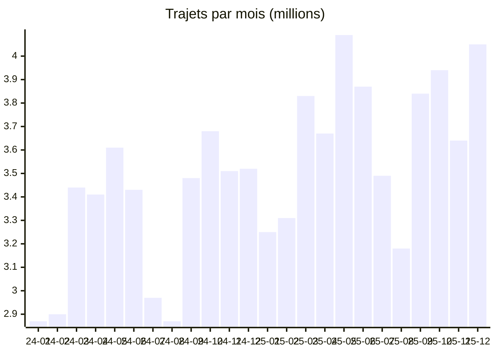

# Rapport d'analyse — NYC Yellow Taxi 2024-2025

> Livrable d'analyse du projet (brief §9). Mesures effectuées le 2026-06-05 sur le pipeline
> complet (Snowflake + dbt), modèles exécutés sur compte réel. Les requêtes de
> reproduction sont en annexe ; les tables interrogées sont les marts `FINAL.*` et
> `STAGING.int_trip_metrics`.

## 1. Contexte et périmètre

Analyse des courses des **yellow cabs new-yorkais** publiées par la TLC (Taxi & Limousine
Commission), fichiers Parquet mensuels ingérés par notre pipeline (`scripts/ingest.sh` →
`RAW` → dbt → `FINAL`).

| Périmètre | Valeur |
|---|---|
| Période couverte | **2024-01 → 2025-12** (24 mois complets) |
| Lignes brutes (RAW) | **89 892 322** |
| Trajets analysés (après nettoyage) | **83 835 030** |

## 2. Qualité des données : ce que le nettoyage révèle

Les filtres qualité de `stg_yellow_taxi_trips` écartent **6 057 292 lignes (−6,7 %)** :
montants totaux négatifs ou nuls, trajets incohérents (dépose antérieure à la prise en
charge), distances aberrantes, horodatages hors période (courses « fantômes » datées de
2001 ou 2098 présentes dans les fichiers sources).

Choix documentés, issus de la review d'équipe (PR #39) :

- **`ratecodeid` NULL ou 99 conservés** (13,8 M de lignes) : un code tarif non renseigné
  ne rend pas la course invalide — les libellés `Inconnu` les rendent lisibles. Les
  écarter aurait coûté **16,5 % de données valides**.
- **`passenger_count` NULL imputé à 1** : valeur la plus probable, mais toute statistique
  passagers est mécaniquement tirée vers 1 (donnée imputée, voir §8).
- **Courses « No charge » / « Dispute » conservées** (1,5 %) : événements métier réels.

## 3. Chiffres clés (83,8 M de trajets)

| KPI | Valeur |
|---|---|
| Revenu total | **2 411 800 709 $** (≈ 2,41 Md$) |
| Panier moyen | **28,77 $** / course |
| Distance moyenne | 3,46 miles (5,6 km) |
| Distance cumulée | **289 894 133 miles** — ≈ 11 600 fois le tour de la Terre |
| Durée moyenne | 17,1 min |
| Vitesse moyenne | **11,3 mph** (18,2 km/h) |
| Passagers par course | 1,27 |
| Activité journalière moyenne | **114 686 trajets** · 3,30 M$ |

**Croissance 2025 vs 2024** : 39,68 M → 44,15 M trajets (**+11,3 %**), revenu
1 137 M$ → 1 275 M$ (**+12,2 %**).

## 4. Géographie : Manhattan roule, les aéroports encaissent

Top 5 des zones de prise en charge par revenu (`zone_analysis` ⨝ seed `taxi_zone_lookup`) :

| # | Zone | Borough | Trajets | Revenu |
|---|---|---|---|---|
| 1 | **JFK Airport** | Queens | 3,75 M | **308,4 M$** |
| 2 | LaGuardia Airport | Queens | 2,48 M | 172,7 M$ |
| 3 | Midtown Center | Manhattan | 3,81 M | 98,0 M$ |
| 4 | Upper East Side South | Manhattan | 3,87 M *(record volume)* | 81,6 M$ |
| 5 | Times Sq/Theatre District | Manhattan | 2,73 M | 79,3 M$ |

Par borough : **Manhattan concentre 87,5 % des trajets** (73,3 M) et 74 % du revenu
(1,78 Md$) ; **Queens ne pèse que 9,3 % des trajets mais 23 % du revenu** — l'effet
aéroports (forfaits JFK + longues distances). Brooklyn (2,0 M), Bronx (0,45 M) et Staten
Island (5 128 courses sur 2 ans !) sont marginaux : le yellow cab est un service de
Manhattan et de ses aéroports.

## 5. Profils temporels

### Par heure
Pointe entre **17 h et 19 h** (pic à 18 h : 5,80 M trajets) ; creux à 4-5 h du matin.
Conséquence mesurable de la congestion : **21,3 mph à 5 h contre 10,3 mph à 17 h** —
la vitesse moyenne est **divisée par deux** aux heures de pointe.

### Par jour de semaine
| Lun | Mar | Mer | Jeu | Ven | Sam | Dim |
|---|---|---|---|---|---|---|
| 98 434 | 112 790 | 119 226 | **124 369** | 118 827 | 123 619 | 105 664 |

Jeudi et samedi se disputent la tête ; le lundi est le jour le plus calme (−21 % vs jeudi).

### Saisonnalité (trajets mensuels, en millions)



Creux en janvier-février et au cœur de l'été (juillet-août), pics en mai, octobre et
décembre. Records mensuels : **mai 2025 en volume (4,09 M trajets)**, **décembre 2025 en
revenu (127,1 M$)** — les fêtes se paient au compteur.

### Records journaliers
- 🏆 Maximum : **samedi 13 décembre 2025 — 174 328 trajets** (rush des fêtes ; les 11 et
  12/12/2025 complètent le podium).
- 📉 Minimum : **Noël 2024 — 52 228 trajets** (−54 % vs moyenne), suivi du 4 juillet.

## 6. Typologie des courses

**Par distance** (seuils de `int_trip_metrics` : < 2 mi / 2-10 mi / ≥ 10 mi) :

| Catégorie | Part | Panier moyen |
|---|---|---|
| Courte (< 2 mi) | **53,6 %** | 17,79 $ |
| Moyenne (2-10 mi) | 38,3 % | 32,36 $ |
| Longue (≥ 10 mi) | 8,1 % | **84,33 $** — les liaisons aéroport |

Plus de la moitié des courses font moins de 2 miles : le yellow cab est d'abord un
transport de micro-trajets denses ; les 8 % de courses longues pèsent pourtant 24 % du
revenu.

**Par période** (découpage de `int_trip_metrics`) : après-midi 35,2 % et soir 34,7 % —
**70 % de l'activité après midi** ; le matin 21,6 % et la nuit seulement 8,5 %.

**Paiements et pourboires** : carte 72,2 %, espèces 11,4 % (champ non renseigné /
« Flex Fare » : 15,0 %). Pourboire moyen **25,3 % du tarif — mesuré sur les paiements
carte uniquement** : la TLC n'enregistre pas les pourboires en espèces (`tip_amount = 0`),
les inclure biaiserait le taux à la baisse. Léger paradoxe weekday/weekend : les courses
de semaine sont plus courtes (3,42 vs 3,56 mi) mais plus chères (29,10 vs 27,94 $) —
l'effet congestion + heures de pointe se paie au compteur.

## 7. Coût et performance du pipeline

| Indicateur | Valeur |
|---|---|
| Run GitHub Actions complet | **≈ 3 min 20** (ingestion ~2 min + dbt build) |
| `dbt build` (seed + 5 modèles + 41 tests, 90 M lignes) | **40 s** sur warehouse X-Small |
| Coût d'un run complet | **≈ 0,06 crédit (~18 ¢)** |
| Compute total du projet | **≈ 6 $** |
| Garde-fous | auto-suspend 60 s, resource monitor, vues `MONITORING.*` |

Analyser 90 millions de courses pour le prix d'un sandwich : c'est l'argument
« optimisation des coûts » du brief, chiffré.

## 8. Limites et biais connus

1. **Pourboires espèces invisibles** (limitation de la source TLC) → taux calculé
   carte-only, assumé et documenté.
2. **`passenger_count` imputé à 1** quand NULL → moyennes passagers sous-estimées.
3. **Vitesses moyennes** : moyenne simple des vitesses par course dans `int` ; les marts
   agrègent en pondérant par le volume.
4. **Zones `Unknown`/`N/A`** (0,2 % des trajets) : pickups hors référentiel TLC, conservés.
5. La latence des vues de monitoring basées sur `ACCOUNT_USAGE` (45 min-3 h) ne concerne
   pas les chiffres de ce rapport (lus directement dans les marts).

## Annexe — requêtes de reproduction

<details>
<summary>Déplier les requêtes SQL</summary>

```sql
-- §1/§2 volumétrie & nettoyage
select (select count(*) from RAW.YELLOW_TAXI_TRIPS) as raw_rows,
       (select count(*) from STAGING.INT_TRIP_METRICS) as clean_rows;

-- §3 kpis globaux
select count(*), sum(total_amount), avg(total_amount), avg(trip_distance),
       sum(trip_distance), avg(trip_duration_minutes), avg(avg_speed_mph),
       avg(passenger_count)
from STAGING.INT_TRIP_METRICS;

-- §4 zones / boroughs
select zone, borough, total_trips, total_revenue from FINAL.ZONE_ANALYSIS
order by total_revenue desc limit 10;
select borough, sum(total_trips), sum(total_revenue) from FINAL.ZONE_ANALYSIS
group by 1 order by 3 desc;

-- §5 temporel
select pickup_hour, trip_count, avg_speed from FINAL.HOURLY_PATTERNS order by trip_count desc;
select dayofweekiso(trip_date), dayname(trip_date), avg(trip_count)
from FINAL.DAILY_SUMMARY group by 1, 2 order by 1;
select trip_date, trip_count from FINAL.DAILY_SUMMARY order by trip_count desc limit 3;
select to_char(trip_date, 'YYYY-MM'), sum(trip_count), sum(total_revenue)
from FINAL.DAILY_SUMMARY group by 1 order by 1;

-- §6 typologie
select categorie_distance, count(*), avg(total_amount) from STAGING.INT_TRIP_METRICS
group by 1 order by 2 desc;
select periode_journee, count(*) from STAGING.INT_TRIP_METRICS group by 1 order by 2 desc;
select payment_type, count(*), ratio_to_report(count(*)) over(),
       avg(case when payment_type = 1 then tip_amount / nullif(fare_amount, 0) * 100 end)
from STAGING.INT_TRIP_METRICS group by 1 order by 2 desc;
```

</details>
